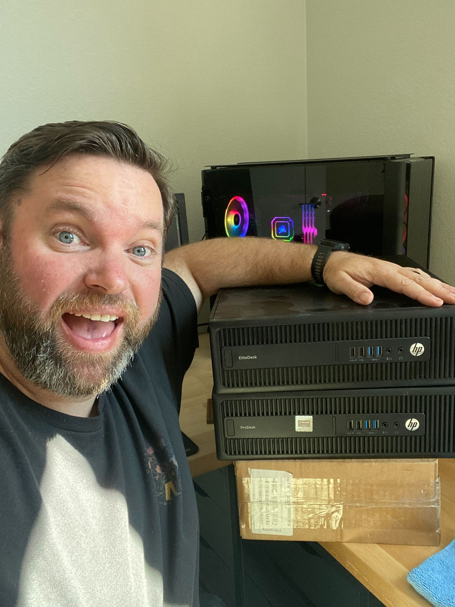

# bare-metal-k8s
A bare metal Kubernetes cluster implemented at home

## Background

I moved into a new house and have to set up my homelab. Rather than standup my usual Proxmox cluster, I decided to go a different direction and build out a bare metal Kubernetes (K8s) cluster instead. My goal is to pass the CKA and CKAD certification exams and learn more about K8s so I figure this is a great place to start.

My original goal was to build a micro cluster using RaspberryPis but they became so hard to find and so dang expensive that I was better off just buying cheap refurbished PCs when they were on sale. I picked up these computers for about $80 a piece. I'm going to call them servers because they are acting in a server capacity but I understand that they aren't high-end server quality.

## Approach

I'll probably work on this on the weekends and inbetween running dunegons for the new World of Warcraft expansion, The War Within. Work, work, work... (dun, dun, duuuuuuuun) queue's up! Additionally, I am only going to use ChatGPT4 and the [Kubernetes Documentation.](https://kubernetes.io/docs/home/)

## Hardware Specs

HP EliteDesk 800 G2 SFF
- CPU: Intel i5 6500
- RAM: 8GB
- Storage: 256 SSD

HP ProDesk 600 G2 SFF
- CPU: Intel i5 6500 
- RAM: 8GB
- Storage: 256 GB SSD

HP EliteDesk 800 G2 Desktop Mini
- CPU: Intel i5 6500
- RAM: 16 GB DDR4
- Storage: 512 GB SSD

